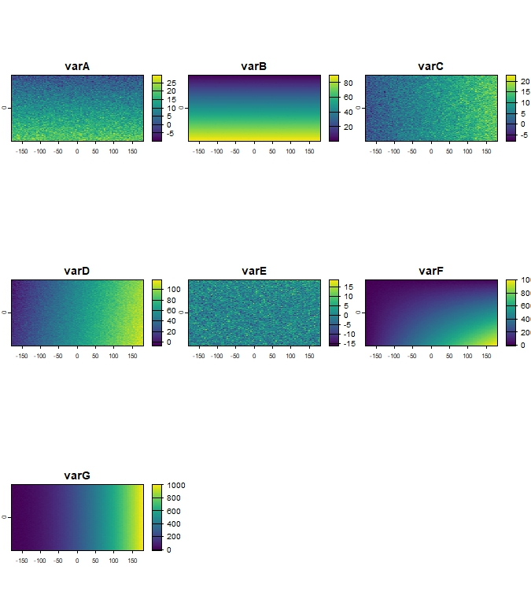
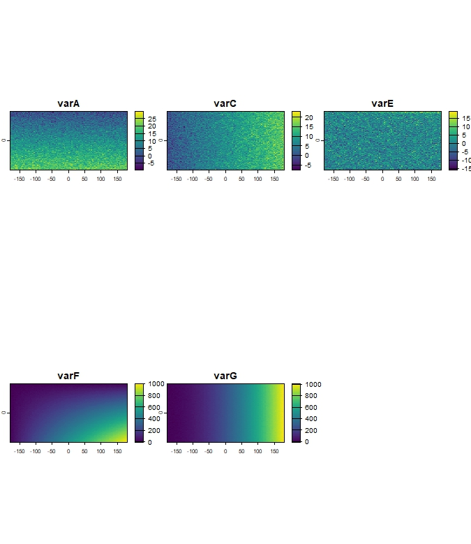
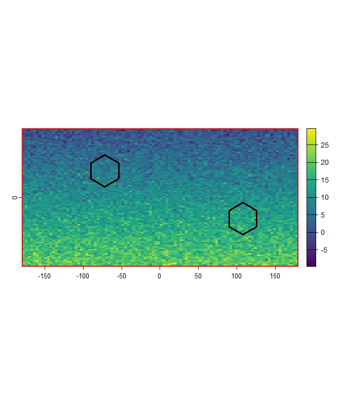
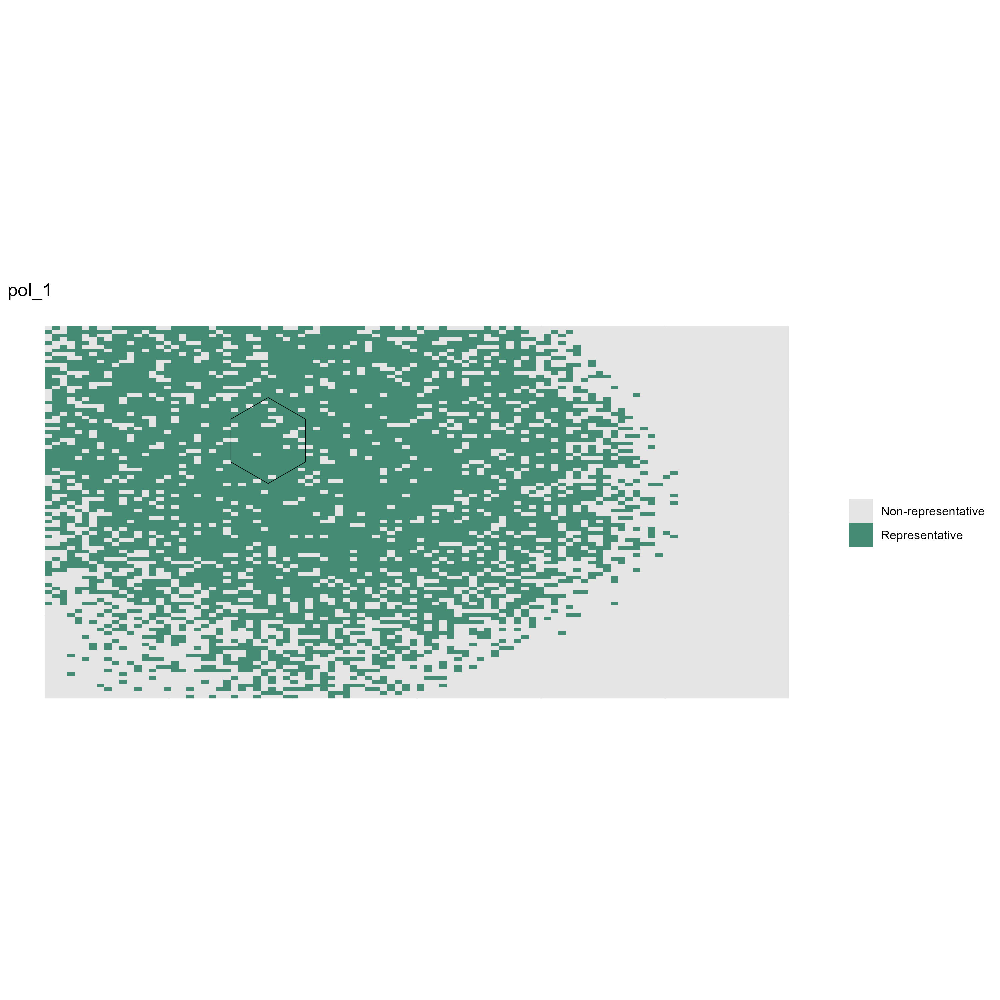
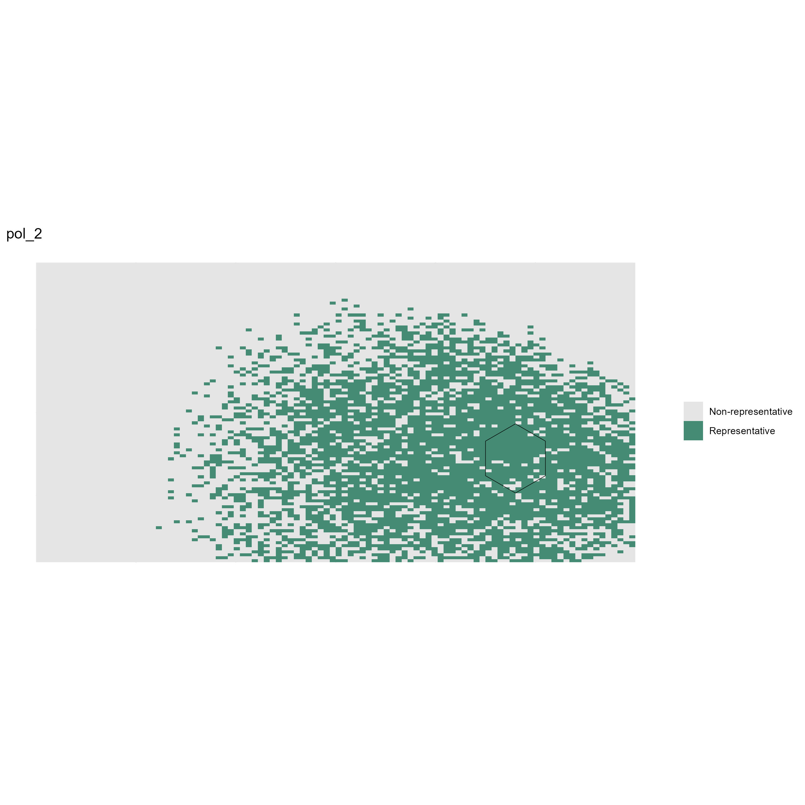
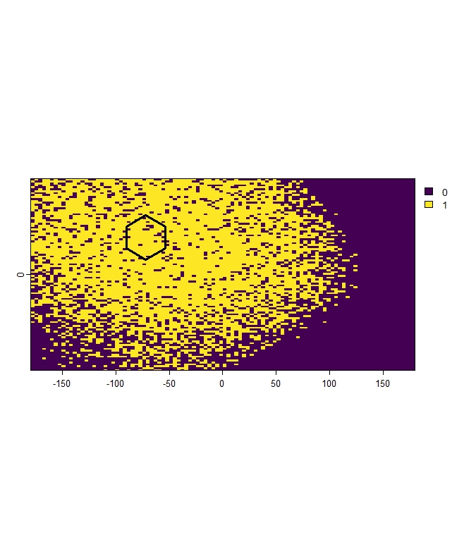
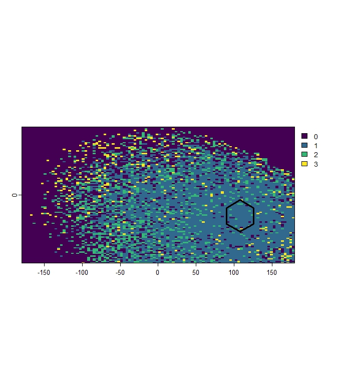
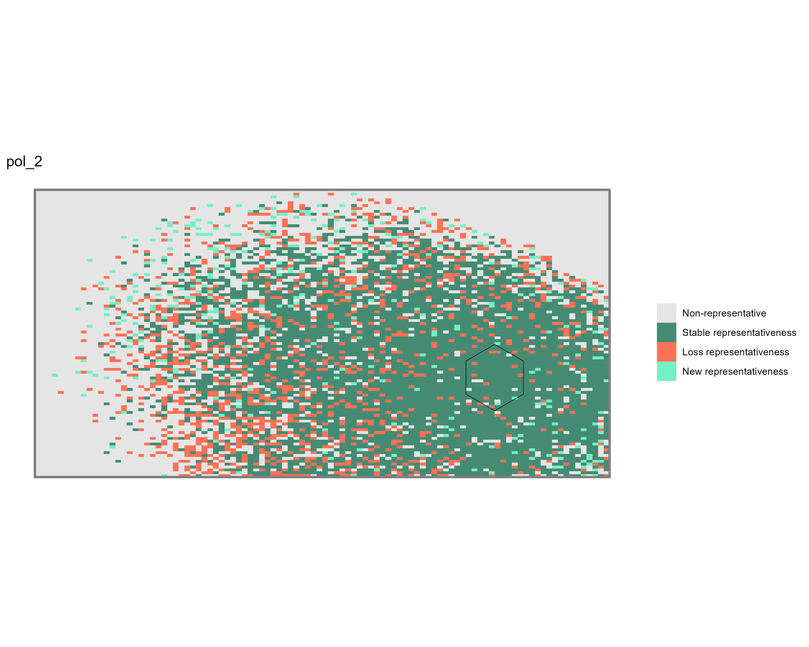
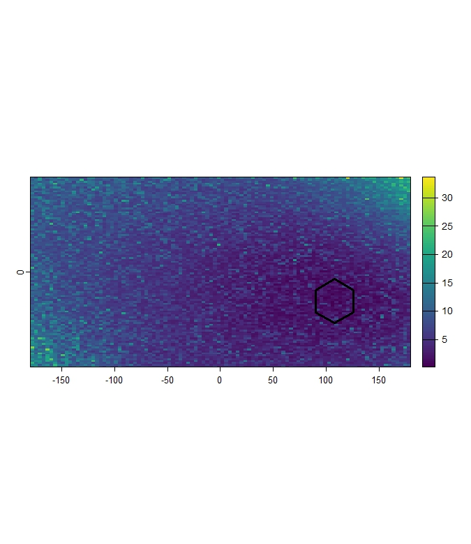
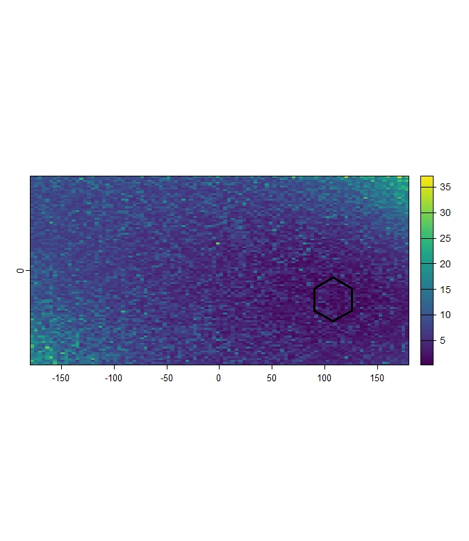

# ClimaRep: Estimating Climate Representativeness

[](https://cran.r-project.org/package=ClimaRep)

## Overview

The **ClimaRep** package provides tools to analyze the climate representativeness of protected areas, particularly focusing on how this representativeness might change under future climate change scenarios.

The package utilizes spatial data, specifically climatic raster layers and protected area polygons, along with a defined study area, to assess the current environmental representativeness and project its evolution under climate change.

Key features include:
* Filtering climatic variables to reduce multicollinearity (`vif_filter`).
* Estimating current environmental representativeness (`mh_rep`).
* Estimating changes in environmental representativeness under future climate projections (`mh_rep_ch`).
* Estimating environmental representativeness overlay (`mh_overlay`).

## Installation

You can install the development version of ClimaRep from GitHub with:
```{r}
install.packages("ClimaRep")
```
Alternatively, you can install the development version from GitHub:
```{r}
install.packages("devtools")
library(devtools)
devtools::install_github("MarioMingarro/ClimaRep")
```
Dependencies:

This package relies on other R packages, notably:

`terra` for efficient handling of raster data (`SpatRaster` objects).
`sf` for robust handling of vector data (`sf` objects).
`dplyr` for general data manipulation tasks.

These dependencies will be installed automatically when you install `ClimaRep`.

## Getting Started

This section provides a brief example demonstrating the core workflow of the package.

First, load the package:

```{r}
library(ClimaRep)
library(terra)
library(sf)
```
Next, prepare your essential input data. You will need:

**Climatic variables** (representing present and future conditions) as `SpatRaster` objects with consistent extent, resolution, and Coordinate Reference System (CRS).
Input area **polygons** as an `sf` object containing one or more polygons, with a column identifying each distinct area (e.g., a 'name' or 'ID' column).
A defined **study area** polygon as a single `sf` object, representing the overall geographic region for climate analysis.

Here is a practical example using simulated data to represent these inputs.
This example simulates a network of defined input areas (represented by two simple polygons) and assesses their climate representativeness within a defined study area in a simulated climate space. 
While this example uses generic polygons, a common application for this package is analyzing protected areas, administrative regions, or sampling sites.

```{r}
# Set seed for reproducibility
set.seed(2458)
# Create a multi-layer SpatRaster for present climate variables
# Simulating different spatial gradients with added noise
n_cells <- 100 * 100
r_clim_present <- rast(ncols = 100, nrows = 100, nlyrs = 7)
values(r_clim_present) <- c((rowFromCell(r_clim_present, 1:n_cells) * 0.2 + rnorm(n_cells, 0, 3)),
                            (rowFromCell(r_clim_present, 1:n_cells) * 0.9 + rnorm(n_cells, 0, 0.2)),
                            (colFromCell(r_clim_present, 1:n_cells) * 0.15 + rnorm(n_cells, 0, 2.5)),
                            (colFromCell(r_clim_present, 1:n_cells) + (rowFromCell(r_clim_present, 1:n_cells))* 0.1 + rnorm(n_cells, 0, 4)),
                            (colFromCell(r_clim_present, 1:n_cells) / (rowFromCell(r_clim_present, 1:n_cells))* 0.1 + rnorm(n_cells, 0, 4)),
                            (colFromCell(r_clim_present, 1:n_cells) * (rowFromCell(r_clim_present, 1:n_cells))* 0.1 + rnorm(n_cells, 0, 4)),
                            (colFromCell(r_clim_present, 1:n_cells) * (colFromCell(r_clim_present, 1:n_cells))* 0.1 + rnorm(n_cells, 0, 4))

)
names(r_clim_present) <- c("varA", "varB", "varC", "varD", "varE", "varF", "varG")
terra::crs(r_clim_present) <- "EPSG:4326"
terra::plot(r_clim_present)
```


*Figure 1: Example simulated climate raster layers.*


Now you can use the package functions:

### 1. Filter Climatic Variables (Optional but Recommended)

Multicollinearity among climate variables can affect multivariate analyses like Mahalanobis distance. 
Use `vif_filter` to iteratively remove variables with a Variance Inflation Factor (VIF) above a specified threshold (`th`).

```{r}
r_clim_present_filtered <- ClimaRep::vif_filter(r_clim_present, th = 5) # Use a VIF threshold

--- VIF Filtering Summary ---
VIF filtering completed.
Kept layers: varA, varC, varE, varF, varG 
Excluded layers:  

Pearson correlation matrix of original data:
        varA   varC    varE    varF   varG
varA  1.0000 0.0087 -0.0745  0.5854 0.0028
varC  0.0087 1.0000  0.0517  0.5694 0.8372
varE -0.0745 0.0517  1.0000 -0.0256 0.0650
varF  0.5854 0.5694 -0.0256  1.0000 0.6350
varG  0.0028 0.8372  0.0650  0.6350 1.0000

Final VIF values for kept variables:
        VIF
varA 2.3475
varC 3.3954
varE 1.0121
varF 3.9725
varG 4.5054
----------------------------

terra::plot(r_clim_present_filtered)
```


*Figure 2: Filtered climate dataset, showing remaining variables.*


### 2. Estimate climate representativeness.
Create example input area polygons and a study area polygon to define the regions for analysis.
```{r}
# Create simple input polygons (2 sample hexagons)
hex_grid <- sf::st_sf(st_make_grid(st_as_sf(as.polygons(terra::ext(r_clim_present))), square = FALSE))
sf::st_crs(hex_grid) <- "EPSG:4326"
polygons <- hex_grid[sample(nrow(hex_grid), 2), ]
polygons$name <- c("Pol_1", "Pol_2")
sf::st_crs(polygons) <- sf::st_crs(hex_grid)

# Create simple study area polygon ---
# Example: Use the extent of the raster
study_area_polygon <- sf::st_as_sf(as.polygons(terra::ext(r_clim_present)))
sf::st_crs(study_area_polygon) <- "EPSG:4326"

terra::plot(r_clim_present[[1]])
terra::plot(polygons, add = TRUE, color= "transparent", lwd = 3)
terra::plot(study_area_polygon, add = TRUE, col = "transparent", lwd = 3, border = "red")
```


*Figure 3: Example input areas (black outline) and study area (red outline) overlaid on a climate raster layer.*

Use `mh_rep` to estimate climate representativeness for each input area (polygon argument). 
The function calculates the Mahalanobis distance for every cell in the climatic_variables raster from the multivariate centroid of climate conditions within each respective input polygon. 
Cells within a certain percentile threshold (`th`) of distances found within the input polygon are considered "represented".
```{r}
ClimaRep::mh_rep(
polygon = polygons,
col_name = "name",
climatic_variables = r_clim_present_filtered,
th = 0.9, # Use a threshold, e.g., 90th percentile
dir_output = tempdir(),
save_intermediate_raster = TRUE
)
----------------------------
Validating and adjusting Coordinate Reference Systems (CRS)...
Starting per-polygon processing...

Processing polygon: area_1 (1 of 2)

Processing polygon: area_2 (2 of 2)

All processes were completed

Output files in: C:\Users\AppData\Local\Temp\RtmpY1rKKD
----------------------------
```
This process generates 3 subfolders within the directory specified by `dir_output` (e.g., `tempdir()`).
```{r}
list.files(tempdir())
 [1] "Charts"             "Mh_Raw"             "Representativeness"
```
1. The `Charts` subfolder contains image files (.jpeg or .png) visualizing the binary representativeness map for each input polygon.
```{r}
list.files(file.path(tempdir(), "Charts"))
```

*Figure 4: Binary representativeness maps for Area_1. Areas matching or exceeding the climate conditions threshold of the input polygon are shown.*

2. The `MahalanobisRaw` subfolder contains the continuous Mahalanobis distance rasters (as `.tif` files) for each input polygon. 
Lower values indicate climates more similar to the polygon's centroid.
```{r}
mh_rep_raw <- rast(list.files(file.path(tempdir(), "MahalanobisRaw"),  pattern = "\\.tif$", full.names = TRUE))
terra::plot(mh_rep_raw[[1]])
terra::plot(polygons[1,], add = TRUE, color= "transparent", lwd = 3)
```

*Figure 5: Example continuous Mahalanobis distance raster for Area_1. Darker shades indicate areas with climate conditions more similar to Area_1.*

3. The `Representativeness` subfolder contains the binary representativeness rasters (as `.tif` files) for each input polygon, based on the threshold (`th`) applied to the raw Mahalanobis distance. 
Cells are typically coded 1 for represented and 0 for not represented.
```{r}
mh_rep_result <- rast(list.files(file.path(tempdir(), "Representativeness"),  pattern = "\\.tif$", full.names = TRUE))
terra::plot(mh_rep_result[[1]])
terra::plot(polygons[1,], add = TRUE, color= "transparent", lwd = 3)
```

*Figure 6: Example binary representativeness raster for Area_1, showing areas classified as represented (value 1) based on the defined threshold.*

### 3. Estimate change in climate representativeness.
To estimate how representativeness changes, a future climate scenario is required. 
In this example, a simple virtual future scenario is created by adding a constant value to the present filtered climate data.

```{r}
r_clim_future <- r_clim_present_filtered + 2 
names(r_clim_future) <- names(r_clim_present_filtered)
terra::crs(r_clim_future) <- terra::crs(r_clim_present_filtered)
terra::plot(r_clim_future)
```


*Figure 7: Example simulated future climate variables.*

Use `mh_rep_ch` to compare representativeness between the `present_climatic_variables` and `future_climatic_variables` within the defined study_area. 
This function calculates representativeness for each input polygon in both scenarios and determines areas where conditions:

Persist (represented in both present and future).
Are Lost (represented in present but not future).
Are Gained (not represented in present but are in future - often represents novel climates becoming analogous).

```{r}
ClimaRep::mh_rep_ch(
polygon = polygons,
col_name = "name",
present_climatic_variables = r_clim_present_filtered,
future_climatic_variables = r_clim_future,
study_area = study_area_polygon,
th = 0.95,
model = "MIROC6",
year = "2070",
dir_output = tempdir(),
save_intermediate_raster = TRUE)

Validating and adjusting Coordinate Reference Systems (CRS)...
Starting process

Processing polygon: pol_1 (1 of 2)

Processing polygon: pol_2 (2 of 2)

All processes were completed

Output files in:  C:\Users\AppData\Local\Temp\RtmpY1rKKD

```
This process generates several subfolders within the directory specified by `dir_output`.
```{r}
list.files(tempdir())
 [1] ""Change"             "Charts"             "Mh_Raw_Pre"             ""Mh_Raw_Fut"

```
The `Change` subfolder contains binary rasters (`.tif`) for each input polygon, indicating the category of change (Persistence, Loss, Gain, or No Representation in either scenario).
```{r}
Change_result <- terra::rast(list.files(file.path(tempdir(), "Change"),  pattern = "\\.tif$", full.names = TRUE))
terra::plot(Change_result[[2]])
terra::plot(polygons[2,], add = TRUE, color= "transparent", lwd = 3)
```

*Figure 8: Example change in representativeness raster for Pol_2, showing areas of persistence, loss, or gain.*

The `Charts` subfolder is updated or regenerated and contains summary image files visualizing the change analysis results for each input polygon.
```{r}
list.files(file.path(tempdir(), "Charts"))
```


*Figure 9: Example summary maps illustrating climate representativeness change for Pol_1 and Pol_2*
The `Mh_Raw_Pre` subfolder contains the continuous raw Mahalanobis distance rasters for the **present** scenario, calculated within the `study_area` extent relative to the climate conditions within each input polygon.
```{r}
Mh_Raw_Pre_result <- terra::rast(list.files(file.path(tempdir(), "Mh_Raw_Pre"),  pattern = "\\.tif$", full.names = TRUE))
terra::plot(Mh_Raw_Pre_result[[2]])
terra::plot(polygons[2,], add = TRUE, color= "transparent", lwd = 3)
```

*Figure 10: Example continuous present-day Mahalanobis distance raster (within study area) for Pol_2.*

The `Mh_Raw_Fut` subfolder contains the continuous raw Mahalanobis distance rasters for the **future** scenario, calculated within the `study_area` extent relative to the climate conditions within each input polygon.
```{r}
Mh_Raw_Fut_result <- terra::rast(list.files(file.path(tempdir(), "Mh_Raw_Fut"),  pattern = "\\.tif$", full.names = TRUE))
terra::plot(Mh_Raw_Fut_result[[2]])
terra::plot(polygons[2,], add = TRUE, color= "transparent", lwd = 3)
```

*Figure 11: Example continuous future Mahalanobis distance raster (within study area) for Pol_1*

### 4. Estimate Environmental Representativeness Overlay (mh_overlay)

## Functions Reference

**vif_filter()**

Filters variables in a `SpatRaster` object (`x`) based on their Variance Inflation Factor (VIF). Variables with VIF above the threshold (`th`) are iteratively removed until all remaining variables have VIF below th. This helps mitigate issues associated with multicollinearity in multivariate analyses.

`vif_filter(x, th)`

`x`: A SpatRaster object with climate layers.

`th`: The VIF threshold.


**mh_rep()**

Estimates the current environmental representativeness of the areas defined by polygon within the climate space of climatic_variables. It calculates Mahalanobis distance for each cell from the climate centroid of the input polygon and identifies cells within a specified threshold distance or percentile as "represented".

`mh_rep(polygon, col_name, climatic_variables, th, dir_output, save_intermediate_raster)`

`polygon`: An `sf` object containing the input areas (polygons).

`col_name`: The name of the column in `polygon` that contains unique identifiers for each input area.

`climatic_variables`: A `SpatRaster` object with the climate layers.

`th`: The threshold for determining representativeness (e.g., 0.9 for the 90th percentile of distances within the input `polygon`).

`dir_output`: Path to the directory where output rasters and charts will be saved.

`save_intermediate_raster`: Logical. If TRUE, saves the continuous Mahalanobis distance raster for each input `polygon`.


**mh_rep_ch()**

Estimates the change in environmental representativeness from present_climatic_variables to future_climatic_variables within the extent of study_area. 
It compares represented conditions between the two scenarios for each input polygon, classifying areas by change category (Persistence, Loss, Gain).

`mh_rep_ch(polygon, col_name, present_climatic_variables, future_climatic_variables, study_area, th, model, year, dir_output, save_intermediate_raster)`

> `polygon`: An sf object containing the input areas (polygons).

> `col_name`: The name of the column in polygon that contains unique identifiers for each input area.

> `present_climatic_variables`: A SpatRaster object with the present climate layers (typically filtered).

> `future_climatic_variables`: A SpatRaster object with the future climate layers.

`study_area`: An sf object defining the overall study region.

`th`: The percentile threshold for determining representativeness in both scenarios.

`model`: Character string identifying the climate model (e.g., "MIROC6"). Used in output filenames.

`year`: Character string identifying the future period (e.g., "2050"). Used in output filenames.

`dir_output`: Path to the directory where output rasters and charts will be saved.

`save_intermediate_raster`: Logical. If TRUE, saves the continuous Mahalanobis distance rasters for both present and future scenarios within the study area extent.


mh_overlay(...):
Citation
If you use the `ClimaRep` package in your research, please cite the underlying methodology paper. If the package itself is formally cited (e.g., on CRAN), please include the package citation as well:


> Mingarro & Lobo (2018). Environmental representativeness and the role of emitter and recipient areas in the future trajectory of a protected area under climate change (https://doi.org/10.32800/abc.2018.41.0333)


Contributing


Getting Help
If you encounter issues or have questions, please open an issue on the GitHub repository: [https://github.com/

License
[Specify the package license, e.g., MIT, GPL-3]


