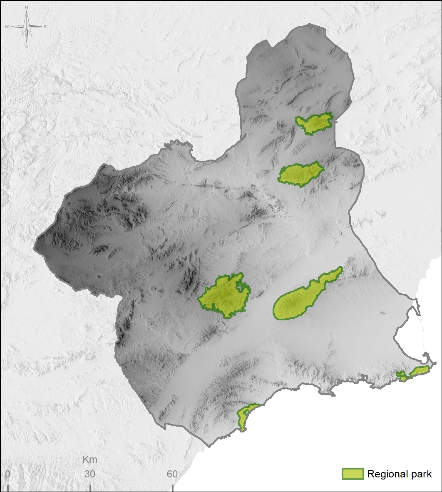
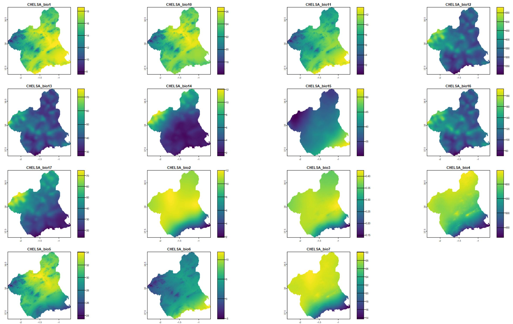
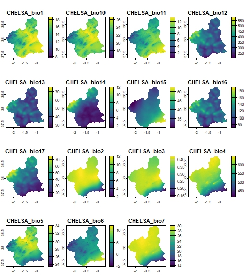

# ClimaRep: Estimating Climate Representativeness

[](https://cran.r-project.org/package=ClimaRep)

## Overview

The **ClimaRep** package provides tools to analyze the climate representativeness of protected areas, particularly focusing on how this representativeness might change under future climate change scenarios.

The package utilizes spatial data, specifically climatic raster layers and protected area polygons, along with a defined study area, to assess the current environmental representativeness and project its evolution under climate change.

Key features include:
* Filtering climatic variables to reduce multicollinearity (`vif_filter`).
* Estimating current environmental representativeness (`mh_present`).
* Estimating changes in environmental representativeness under future climate projections (`mh_present_future`).
* Estimating environmental representativeness overlay (`mh_overlay`).

## Installation

You can install the development version of ClimaRep from GitHub with:
```{r}
install.packages("ClimaRep")
```
Alternatively, you can install the development version from GitHub:
```{r}
install.packages("devtools")
library(devtools)
devtools::install_github("MarioMingarro/ClimaRep")
```
Dependencies:

This package relies on other R packages, notably:

`terra` for handling raster data.

`sf` for handling vector data.

`dplyr` for data manipulation.

These dependencies will be installed automatically when you install `ClimaRep`.

## Getting Started

This section provides a brief example demonstrating the core workflow of the package.

First, load the package:

```{r}
library(ClimaRep)
library(terra)
library(sf)
```
Next, prepare your input data. You will need:

* **Climatic variables** (present and future) as `SpatRaster` objects.
* **Protected area polygons** as an `sf` object.
* A defined **study area** polygon as an `sf` object.

Here is a practical example.

This example explores the climate representativeness of a Protected Area network situated in Murcia, in the southwest of the Iberian Peninsula. In total, 6 Regional Parks have been used as an example.




*Figure 1: Regional Parks considered as the protected area network used in this analysis.*


Now you can use the package functions:

### 1. Filter Climatic Variables (Optional but Recommended)

Use `vif_filter` to remove highly correlated variables based on Variance Inflation Factor (VIF).



kkk



*Figure 2: Climate dataset considered in this analysis.*

```{r}

# Filter present climatic variables
r_clim_filtered <- vif_filter(x = r_clim_present, th = 5) # Use a VIF threshold (e.g., 5 or 10)


# You might also filter future variables or ensure consistency after filtering present
# Consider how filtering applies to your future layers - typically based on present VIFs.
# For this example, we'll just use the filtered present set for both present/future analysis
# assuming filtering criteria derived from the present are applicable.
```
### 2. Estimate climate representativeness.
Use `mh_present` to estimate representativeness between present and future climates. Calculate environmental representativeness for protected areas in the current climate
```{r}
# Note: 'climatic_variables' should be the *filtered* present variables if you used vif_filter
mh_present(
  polygon = protected_areas,
  col_name = "name", # Column in 'polygon' with unique names
  climatic_variables = r_clim_filtered, # Use filtered present climate
  th = 0.95, # Threshold for representativeness (e.g., 95th percentile)
  dir_output = output_dir,
  save_intermediate_raster = TRUE
)

cat("Present analysis results saved to:", output_dir, "\n")
# Check the 'output_dir' for results (e.g., rasters or tables per polygon)
```
### 3. Estimate change in climate representativeness.

Use `mh_present_future` to compare representativeness between present and future climates.

```{r}

# Note: Ensure present_climatic_variables and future_climatic_variables
# have the same number of layers and layer names after any filtering.

r_clim_future_filtered <- terra::subset(r_clim_future, names(r_clim_filtered)) # Ensure layers match

mh_present_future(
  polygon = protected_areas,
  col_name = "name", # Column in 'polygon' with unique names
  present_climatic_variables = r_clim_filtered, # Use filtered present climate
  future_climatic_variables = r_clim_future_filtered, # Use filtered future climate (matching layers)
  study_area = study_area_polygon, # Polygon defining the study area
  th = 0.95, # Threshold for representativeness (should match mh_present)
  model = "GFDL-ESM4", # Example climate model name
  year = 2050, # Example future year
  dir_output = output_dir,
  save_intermediate_raster = TRUE
)

cat("Present-Future analysis results saved to:", output_dir, "\n")
# Check the 'output_dir' for additional results related to the future scenario
```

Functions
vif_filter(x, th): Filters variables in a SpatRaster object (x) based on their Variance Inflation Factor (VIF). Variables with VIF above the threshold (th) are iteratively removed until all remaining variables have VIF below th. This helps mitigate issues associated with multicollinearity in subsequent analyses.

mh_present(polygon, col_name, climatic_variables, th, dir_output, save_intermediate_raster): Estimates the environmental representativeness of given polygon areas within the climatic_variables layer. It identifies the environmental conditions present within each polygon and assesses how widespread those conditions are within the overall climate space covered by the raster. Results are typically saved to dir_output. th likely relates to the percentile or threshold used to define the "represented" conditions.

mh_present_future(polygon, col_name, present_climatic_variables, future_climatic_variables, study_area, th, model, year, dir_output, save_intermediate_raster): Extends the present analysis to a future climate scenario. It estimates the environmental representativeness in the present and compares it to the representativeness (or novel/lost conditions) under future_climatic_variables, within the defined study_area. model and year help identify the future scenario. Results are typically saved to dir_output, allowing comparison between present and future conditions.

Citation
If you use this package in your research, please cite both the package and the underlying methodology paper:


> Mingarro & Lobo (2018). Environmental representativeness and the role of emitter and recipient areas in the future trajectory of a protected area under climate change (https://doi.org/10.32800/abc.2018.41.0333)


Contributing


Getting Help
If you encounter issues or have questions, please open an issue on the GitHub repository: [https://github.com/

License
[Specify the package license, e.g., MIT, GPL-3]


# --- Create simple present climatic data () ---
set.seed(235)
n_cells <- 100 * 100
r_clim_present <- rast(ncols = 100, nrows = 100, nlyrs = 6)
values(r_clim_present) <- c((rowFromCell(r_clim_present, 1:n_cells)
  1:n_cells * 0.1 + rnorm(n_cells, 0, 2),
  1:n_cells * 0.05 + rnorm(n_cells, 0, 1),
  rnorm(n_cells, 10, 3),
  
)
names(r_clim_present) <- c("varA", "varB", "varC")
terra::crs(r_clim_present) <- "EPSG:4326"

```{r}
# --- Create simple future climatic data ---
# Example: Add an increment to present variables
r_clim_future <- r_clim_present + 2 # Simple increment
names(r_clim_future) <- names(r_clim_present)
terra::crs(r_clim_future) <- terra::crs(r_clim_present)


# --- Create simple protected area polygons ---
hex_grid <- st_sf(st_make_grid(st_as_sf(as.polygons(terra::ext(r_clim_present))), square = FALSE))
st_crs(hex_grid) <- "EPSG:4326"
protected_areas <- hex_grid[sample(nrow(hex_grid), 2), ]
protected_areas$name <- c("Area_1", "Area_2") # Column with polygon names
st_crs(protected_areas) <- st_crs(hex_grid)

# --- Create simple study area polygon ---
# Example: Use the extent of the raster
study_area_polygon <- st_as_sf(as.polygons(terra::ext(r_clim_present)))
st_crs(study_area_polygon) <- "EPSG:4326"

# --- Define output directory ---
output_dir <- "results_analysis"
if (!dir.exists(output_dir)) dir.create(output_dir)
plot(r_clim_present)
plot(r_clim_future)
```

