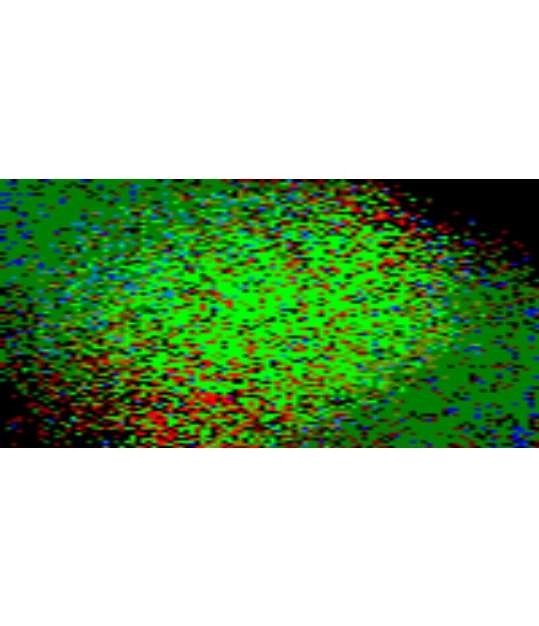

# ClimaRep: Estimating Climate Representativeness

[](https://cran.r-project.org/package=ClimaRep)

## Overview

The `ClimaRep` package offers tools to analyze the **climate representativeness** of defined areas, assessing current conditions and evaluating how they are projected to change under future climate change scenarios. 
Using spatial data, including climate raster layers, the input area polygons, and a polygon of the study area, the package quantifies this representativeness and analyzes its transformation.

Key features include:
* Filtering raster climate variables to reduce multicollinearity (`vif_filter`).
* Estimating current climate representativeness (`mh_rep`).
* Estimating changes in climate representativeness under future climate projections (`mh_rep_ch`).
* Estimating climate representativeness overlay (`mh_overlay`).

## Installation

You can install the development version of ClimaRep from GitHub with:
```{r}
install.packages("ClimaRep")
```
Alternatively, you can install the development version from GitHub:
```{r}
install.packages("devtools")
library(devtools)
devtools::install_github("MarioMingarro/ClimaRep")
```
Dependencies:

This package relies on other R packages, notably:

> `terra` for efficient handling of raster data (`SpatRaster` objects).

> `sf` for robust handling of vector data (`sf` objects).

> `stats` for statistical analysis.

> `ggplot2` and `tidyterra` for visualization tasks.

These dependencies will be installed automatically when you install `ClimaRep`.

## Getting Started

This section provides a brief example demonstrating the core workflow of the package.


*Figure 1: Example of workflow.*

First, load the package:

```{r}
library(ClimaRep)
library(terra)
library(sf)
```
Next, prepare the essential input data:

1. **Climate variables** as an `SpatRaster` objects with consistent extent, resolution, and Coordinate Reference System (CRS).

2. **Polygon** as an `sf` object containing one or more polygons, with a column identifying each distinct area (e.g., a 'name' or 'ID' column).

3. **Study area** as a single `sf` object, representing the overall geographical region for analysis and thus the **climate space** being worked on.


Here is a practical example using simulated data:
The example simulates a pair of defined input areas and assesses their climate representativeness and transformation within a defined climate space. 
This involves creating a simulated climate space (represented as a `study_area`) within which the analysis is performed.

Generate simulated climate raster layers.

```{r}
set.seed(2458)
n_cells <- 100 * 100
r_clim_present <- terra::rast(ncols = 100, nrows = 100, nlyrs = 7)
values(r_clim_present) <- c(
  (rowFromCell(r_clim_present, 1:n_cells) * 0.2 + rnorm(n_cells, 0, 3)),
  (rowFromCell(r_clim_present, 1:n_cells) * 0.9 + rnorm(n_cells, 0, 0.2)),
  (colFromCell(r_clim_present, 1:n_cells) * 0.15 + rnorm(n_cells, 0, 2.5)),
  (colFromCell(r_clim_present, 1:n_cells) + 
     rowFromCell(r_clim_present, 1:n_cells) * 0.1 + rnorm(n_cells, 0, 4)),
  (colFromCell(r_clim_present, 1:n_cells) /
     rowFromCell(r_clim_present, 1:n_cells) * 0.1 + rnorm(n_cells, 0, 4)),
  (colFromCell(r_clim_present, 1:n_cells) *
     (rowFromCell(r_clim_present, 1:n_cells) + 0.1 + rnorm(n_cells, 0, 4))),
  (colFromCell(r_clim_present, 1:n_cells) *
     (colFromCell(r_clim_present, 1:n_cells) + 0.1 + rnorm(n_cells, 0, 4))))
names(r_clim_present) <- c("varA", "varB", "varC", "varD", "varE", "varF", "varG")
terra::crs(r_clim_present) <- "EPSG:4326"
terra::plot(r_clim_present)
```


*Figure 1: Example of simulated climate raster layers (r_clim_present).*


### 1. Filter climate Variables

A crucial first step in processing the climate variables is often to address multicollinearity. Multicollinearity among climate variables can affect multivariate analyses. 
To handle this, the `vif_filter` function can be used to iteratively remove variables with a Variance Inflation Factor (VIF) above a specified threshold (e.g., `th = 5`).

The output of `vif_filter` returns a new `SpatRaster` object containing only the variables that were kept and also provides a comprehensive summary printed to the console. 
It also prints a summary including:
- The lists of variables that were kept and those that were excluded.
- The original Pearson's correlation matrix between all initial variables.
- The final VIF values for the variables that were retained after the filtering process.


```{r}
r_clim_present_filtered <- vif_filter(r_clim_present, th = 5)

--- VIF Filtering Summary ---
VIF filtering completed.
Kept layers: varA, varC, varE, varF, varG 
Excluded layers: varD, varB 

Pearson correlation matrix of original data:
        varA    varB   varC   varD    varE    varF   varG
varA  1.0000  0.8870 0.0087 0.0938 -0.0745  0.5816 0.0028
varB  0.8870  1.0000 0.0043 0.0997 -0.0769  0.6513 0.0003
varC  0.0087  0.0043 1.0000 0.8523  0.0517  0.5676 0.8341
varD  0.0938  0.0997 0.8523 1.0000  0.0576  0.7077 0.9529
varE -0.0745 -0.0769 0.0517 0.0576  1.0000 -0.0256 0.0653
varF  0.5816  0.6513 0.5676 0.7077 -0.0256  1.0000 0.6305
varG  0.0028  0.0003 0.8341 0.9529  0.0653  0.6305 1.0000

Final VIF values for kept variables:
        VIF
varA 2.2832
varC 3.3473
varE 1.0121
varF 3.8325
varG 4.3545
----------------------------

terra::plot(r_clim_present_filtered)
```


*Figure 2: Example of filtered climate dataset, showing remaining variables (r_clim_present_filtered) after vif_filter() function.*

### 2. Estimate climate representativeness.
Create example input area `polygon` (`sf`) and a `study_area` polygon (`sf`) to define the region and climate space for analysis.
```{r}
# Create simple input polygons (2 sample hexagons)
hex_grid <- sf::st_sf(
  sf::st_make_grid(
    sf::st_as_sf(
      terra::as.polygons(
        terra::ext(r_clim_present))), 
  square = FALSE))
sf::st_crs(hex_grid) <- "EPSG:4326"
polygons <- hex_grid[sample(nrow(hex_grid), 2), ]
polygons$name <- c("Pol_1", "Pol_2")
sf::st_crs(polygons) <- sf::st_crs(hex_grid)
study_area_polygon <- sf::st_as_sf(as.polygons(terra::ext(r_clim_present)))
sf::st_crs(study_area_polygon) <- "EPSG:4326"
terra::plot(r_clim_present[[1]])
terra::plot(polygons, add = TRUE, color= "transparent", lwd = 3)
terra::plot(study_area_polygon, add = TRUE, col = "transparent", lwd = 3, border = "red")
```


*Figure 3: Example of input polygons (black outline) and study area (red outline) overlaid on a climate raster layer.*

Use `mh_rep` to estimate climate representativeness for each input `polygon`. 
The function calculates the Mahalanobis distance from the multivariate centroid of climate conditions within each `polygon` to all cells in the `study_area`. 
Cells within a certain percentile threshold (`th`) of distances found within the input `polygon` are considered representativeness.
```{r}
mh_rep(
  polygon = polygons,
  col_name = "name",
  climate_variables = r_clim_present_filtered,
  th = 0.9, # Use a threshold, e.g., 90th percentile
  dir_output = tempdir(),
  save_raw = TRUE)
  
  
----------------------------
Validating and adjusting Coordinate Reference Systems (CRS)...
Starting per-polygon processing...

Processing polygon: area_1 (1 of 2)

Processing polygon: area_2 (2 of 2)

All processes were completed

Output files in: C:\Users\AppData\Local\Temp\RtmpY1rKKD
----------------------------


```
This process generates 3 subfolders within the directory specified by `dir_output` (e.g., `tempdir()`).
```{r}
list.files(tempdir())
 [1] "Charts"             "Mh_Raw"             "Representativeness"
```

1. The `Charts` subfolder contains the **binary representativeness** image files (`.jpeg`) for each input `polygon`.

```{r}
list.files(file.path(tempdir(), "Charts"))
[1] "pol_1_rep.jpeg" "pol_2_rep.jpeg"
```


*Figure 4: Example of binary representativeness map for Pol_1 (pol_1_rep.jpeg).*

2. The `Mh_Raw` subfolder contains the **continuous Mahalanobis distance** rasters (`.tif`) for each input `polygon`. 
Lower values indicate climates more similar to the polygon's centroid.

```{r}
mh_rep_raw <- terra::rast(list.files(file.path(tempdir(), "Mh_Raw"),  pattern = "\\.tif$", full.names = TRUE))
terra::plot(mh_rep_raw[[1]])
terra::plot(polygons[1,], add = TRUE, color= "transparent", lwd = 3)
```


*Figure 5: Example of continuous Mahalanobis distance raster for Pol_1. Darker shades indicate cells with climate conditions more similar to Pol_1.*

3. The `Representativeness` subfolder contains the **binary representativeness** rasters (`.tif`) for each input `polygon`, based on the threshold (`th`) applied to the raw Mahalanobis distance.
Cells are coded `1` for `represented` and `0` for not represented.
```{r}
mh_rep_result <- terra::rast(list.files(file.path(tempdir(), "Representativeness"),  pattern = "\\.tif$", full.names = TRUE))
terra::plot(mh_rep_result[[1]])
terra::plot(polygons[1,], add = TRUE, color= "transparent", lwd = 3)
```


*Figure 6: Example of binary representativeness raster for Pol_1, showing cells classified as represented (value 1).*

### 3. Estimate change in climate representativeness.
To estimate how representativeness changes, a future climate scenario is required. 
In this example, a simple virtual future climate conditions (`SpatRaster`) are created by adding a constant value to the `r_clim_present_filtered` data.

```{r}
r_clim_future <- r_clim_present_filtered + 2 
names(r_clim_future) <- names(r_clim_present_filtered)
terra::crs(r_clim_future) <- terra::crs(r_clim_present_filtered)
terra::plot(r_clim_future)
```


*Figure 7: Example of simulated future climate variables.*

Use `mh_rep_ch` to compare representativeness between the `present_climate_variables` and `future_climate_variables` within the defined `study_area`. 
This function calculates representativeness for each input `polygon` in both scenarios and determines cells where conditions:

- **Retained** - Are present in both currently and future.
- **Lost** - Are present currently, but not present in the future.
- **Novel** - Are present in the future, but not present currently.

```{r}
mh_rep_ch(
polygon = polygons,
col_name = "name",
present_climate_variables = r_clim_present_filtered,
future_climate_variables = r_clim_future,
study_area = study_area_polygon,
th = 0.95,
model = "MODEL",
year = "2070",
dir_output = tempdir(),
save_raw = TRUE)

Validating and adjusting Coordinate Reference Systems (CRS)...
Starting process

Processing polygon: pol_1 (1 of 2)

Processing polygon: pol_2 (2 of 2)

All processes were completed

Output files in:  C:\Users\AppData\Local\Temp\RtmpY1rKKD

```

This process generates several subfolders within the directory specified by `dir_output`.

```{r}
list.files(tempdir())
 [1] ""Change"             "Charts"             "Mh_Raw_Pre"             ""Mh_Raw_Fut"

```

The `Change` subfolder contains binary rasters (`.tif`) for each input `polygon`, indicating the category of change 
(`0` = Non Represented, `1` = Retained, `2` = Lost, `3` = Novel).

```{r}
change_result <- terra::rast(list.files(file.path(tempdir(), "Change"),  pattern = "\\.tif$", full.names = TRUE))
terra::plot(change_result[[2]])
terra::plot(polygons[2,], add = TRUE, color= "transparent", lwd = 3)
```


*Figure 8: Example of change in representativeness for Pol_2, showing areas Non Represented (0), Retained (1), Lost (2), Novel (3).*

The `Charts` subfolder is updated or regenerated and contains **summary map** files (`.jpeg`) visualizing the change analysis results for each input `polygon`.

```{r}
list.files(file.path(tempdir(), "Charts"))
[1] "pol_1_rep_change.jpeg" "pol_2_rep_change.jpeg"
```


*Figure 9: Example of summary maps illustrating climate representativeness change for Pol_2 (pol_2_rep_change.jpeg).*

The `Mh_Raw_Pre` subfolder contains the **continuous Mahalanobis distance** rasters (`.tif`) for the **present** scenario, calculated within the `study_area` extent relative to the climate conditions within each input `polygon`.

```{r}
Mh_Raw_Pre_result <- terra::rast(list.files(file.path(tempdir(), "Mh_Raw_Pre"),  pattern = "\\.tif$", full.names = TRUE))
terra::plot(Mh_Raw_Pre_result[[2]])
terra::plot(polygons[2,], add = TRUE, color= "transparent", lwd = 3)
```


*Figure 10: Example continuous present-day Mahalanobis distance raster (within study area) for Pol_2.*

The `Mh_Raw_Fut` subfolder contains the **continuous raw Mahalanobis distance** rasters (`.tif`) for the **future** scenario, calculated within the `study_area` extent relative to the climate conditions within each input `polygon`.

```{r}
Mh_Raw_Fut_result <- terra::rast(list.files(file.path(tempdir(), "Mh_Raw_Fut"),  pattern = "\\.tif$", full.names = TRUE))
terra::plot(Mh_Raw_Fut_result[[2]])
terra::plot(polygons[2,], add = TRUE, color= "transparent", lwd = 3)
```


*Figure 11: Example continuous future Mahalanobis distance raster for Pol_2.*

### 4. Estimate Environmental Representativeness Overlay (mh_overlay)
After obtaining the representativeness change rasters for multiple polygons using `mh_rep_ch`, you can combine them to visualize where different change types (**Retained, Lost, Novel**) accumulate. 
The `mh_overlay` function counting, for each cell, how many of the input rasters had a specific category value at that location.

```{r}
mh_overlay(
  folder_path = file.path(tempdir(), "Change"),
  add_to_environment = TRUE)
terra::plot(climarep_img)
```


*Figure 11: Example of accumulate Retained (1), Lost (2) or Novel (3) cells.*

## Functions Reference

**vif_filter()**

Filters variables in a `SpatRaster` object (`x`) based on their Variance Inflation Factor (VIF).
Variables with VIF above the threshold are iteratively removed until all remaining variables have VIF below `th`. 

`vif_filter(x, th)`

> `x`: A `SpatRaster` object with climate layers.

> `th`: The VIF `threshold`.

**mh_rep()**

Estimates the current climate representativeness of areas defined by `polygon` relative to the climate space spanned by `climate_variables` across the `study_area`. 
It calculates Mahalanobis distance for each cell from the climate centroid of the input `polygon` and identifies cells within a specified threshold distance or percentile as "representativeness".

`mh_rep(polygon, col_name, climate_variables, th, dir_output, save_raw)`

> `polygon`: An `sf` object containing the input polygon(s) for which representativeness will be assessed.

> `col_name`: The `name` of the column in `polygon` that contains unique identifiers for each input `polygon`.

> `climate_variables`: A `SpatRaster` object with the climate layers (typically pre-filtered using `vif_filter`).

> `th`: The `threshold` for determining representativeness (e.g., 0.9 for the 90th percentile of distances within the input `polygon`).

> `dir_output`: Path to the `directory` where output rasters and charts will be saved. The directory will be created if it doesn't exist.

> `save_raw`: Logical. If `TRUE`, saves the continuous Mahalanobis distance raster (`Mh_Raw`) for each input `polygon`.

**mh_rep_ch()**

Estimates the change in climate representativeness for the areas defined by `polygon` between present (`present_climate_variables`) and future (`future_climate_variables`) climate conditions. 
For each input `polygon`, it compares the representativeness across the two scenarios and classifies areas into change categories: Retained, Lost, or Novel.

`mh_rep_ch(polygon, col_name, present_climate_variables, future_climate_variables, study_area, th, model, year, dir_output, save_raw)`

> `polygon`: An `sf` object containing the input polygon/s for which representativeness change will be assessed.

> `col_name`: The `name` of the column in `polygon` that contains unique identifiers for each input `polygon`.

> `present_climate_variables`: A `SpatRaster` object with the present climate layers (typically pre-filtered using `vif_filter`).

> `future_climate_variables`: A `SpatRaster` object with the future climate layers (usually same as `present_climate_variables`).

> `study_area`: An `sf` object defining the overall study region.

> `th`: The percentile `threshold` for determining representativeness in both scenarios (e.g., 0.9 for the 90th percentile of distances within the input `polygon`).

> `model`: `Character string` identifying the climate model (e.g., "MIROC6"). This is used in output filenames for clear identification.

> `year`: `Character string` identifying the future period (e.g., "2050"). This is used in output filenames for clear identification.

> `dir_output`: Path to the `directory` where output rasters and charts will be saved. The directory will be created if it doesn't exist.

> `save_raw`: Logical. If `TRUE`, saves the continuous Mahalanobis distance rasters (`Mh_Raw`) for both present and future scenarios within the study area extent.

**mh_overlay()**

Combines multiple single-layer rasters (`.tif`, outputs from `mh_rep` or `mh_rep_ch`) into a single multi-layered `SpatRaster` stack specifically designed for RGB visualization. 
The output layers consistently represent the cumulative counts for 'Lost' (Red channel), 'Retained' (Green channel), and 'Novel' (Blue channel) categories across all rasters (obtained from `mh_rep_ch()`). 
This function automatically handles inputs that may only contain 'Retained' areas (obtained from `mh_rep()`).

`mh_overlay(folder_path, add_to_environment)`

> `folder_path`: Character string. Path to the directory containing the input single-layer GeoTIFF classification rasters (outputs from `mh_rep_ch()` or `mh_rep()`).

> `add_to_environment`: Logical. If `TRUE`, the resulting multi-layered SpatRaster object is assigned to a variable named `climarep_rgb`  in the global R environment.


## Citation

If the package itself is formally cited (e.g., on CRAN), please include the package citation as well:

> Mingarro & Lobo (2021) Connecting protected areas in the Iberian peninsula to facilitate climate change tracking. *Environmental Conservation*, 48(3): 182-191. doi:10.1017/S037689292100014X

> Mingarro, Aguilera-Benavente & Lobo (2020) A methodology to assess the future connectivity of protected areas by combining climatic representativeness and land-cover change simulations: the case of the Guadarrama National Park (Madrid, Spain). *Environmental Planning and Management*, 64(4): 734–753. doi.org/10.1080/09640568.2020.1782859

> Mingarro & Lobo (2018) Environmental representativeness and the role of emitter and recipient areas in the future trajectory of a protected area under climate change. *Animal Biodiversity and Conservation*, 41(2): 333–344. doi.org/10.32800/abc.2018.41.0333


## Getting Help
If you encounter issues or have questions, please contact.

##License
MIT, GPL-3


